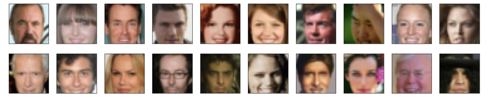
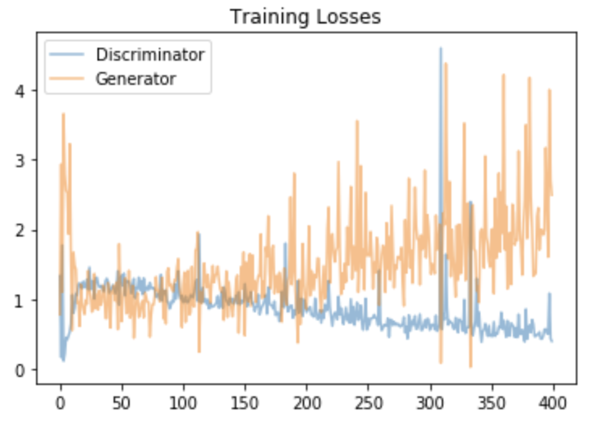
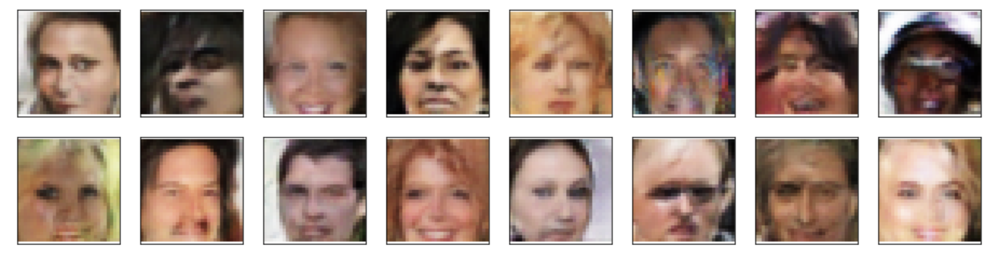

# Generate_Faces_Udacity_GANs_Project

In this project, we want to define and train a DCGAN on a dataset of faces. Our goal is to get a generator network to generate new images of faces that look as realistic as possible!

## Dataset

We'll be using the [CelebFaces Attributes Dataset (CelebA)](http://mmlab.ie.cuhk.edu.hk/projects/CelebA.html) to train our adversarial networks.

### Pre-processed Data

Since the project's main focus is on building the GANs, we've done some of the pre-processing for you. Each of the CelebA images has been cropped to remove parts of the image that don't include a face, then resized down to 64x64x3 NumPy images. Some sample data is show below.



## Model

Here is the defined model including discriminator and generator.

```
Discriminator(
  (conv1): Sequential(
    (0): Conv2d(3, 32, kernel_size=(4, 4), stride=(2, 2), padding=(1, 1), bias=False)
  )
  (conv2): Sequential(
    (0): Conv2d(32, 64, kernel_size=(4, 4), stride=(2, 2), padding=(1, 1), bias=False)
    (1): BatchNorm2d(64, eps=1e-05, momentum=0.1, affine=True, track_running_stats=True)
  )
  (conv3): Sequential(
    (0): Conv2d(64, 128, kernel_size=(4, 4), stride=(2, 2), padding=(1, 1), bias=False)
    (1): BatchNorm2d(128, eps=1e-05, momentum=0.1, affine=True, track_running_stats=True)
  )
  (fc): Linear(in_features=2048, out_features=1, bias=True)
)

Generator(
  (fc): Linear(in_features=100, out_features=2048, bias=True)
  (t_conv1): Sequential(
    (0): ConvTranspose2d(128, 64, kernel_size=(4, 4), stride=(2, 2), padding=(1, 1), bias=False)
    (1): BatchNorm2d(64, eps=1e-05, momentum=0.1, affine=True, track_running_stats=True)
  )
  (t_conv2): Sequential(
    (0): ConvTranspose2d(64, 32, kernel_size=(4, 4), stride=(2, 2), padding=(1, 1), bias=False)
    (1): BatchNorm2d(32, eps=1e-05, momentum=0.1, affine=True, track_running_stats=True)
  )
  (t_conv3): Sequential(
    (0): ConvTranspose2d(32, 3, kernel_size=(4, 4), stride=(2, 2), padding=(1, 1), bias=False)
  )
)
```

## Training loss



## Results (Generator samples from training)



What I notice:
- Most of the generated sample faces are white, and that is due to the dataset is biased
- The generated samples are quite good
- The dataset itself doesn't show the chin part of the face, and it leads to the same issue of our generated samples don't have chin as well.
- The model size are good enough to learn MOST OF the face features such as nose, eyes, hair color, skin color, lips, eyebrow, mustache and so on.

What I can improve this model:
- I wouldl ike to play around with other batch_size, number of epoches in order to find a better and efficient hyperparameters.
- To use in production, I might want to make the model deeper to make sure that it can learn more face features, and can generate more variety of samples.

## What's next ?
- Create a deeper model and use it to generate larger (say 128x128) images of faces.
- Read existing literature to see if you can use padding and normalization techniques to generate higher-resolution images.
- Implement a learning rate that evolves over time as they did in this [CycleGAN Github repo](https://github.com/junyanz/pytorch-CycleGAN-and-pix2pix).
- See if you can extend this model and use a CycleGAN to learn to swap different kinds of faces. For example, learn a mapping between faces that have and do not have eye/lip makeup, as they did in [this paper](https://gfx.cs.princeton.edu/pubs/Chang_2018_PAS/Chang-CVPR-2018.pdf).
